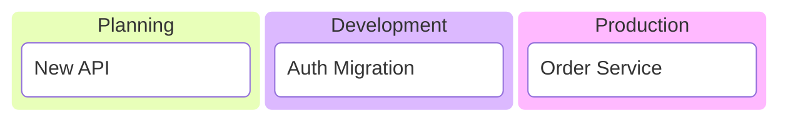
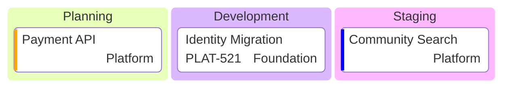
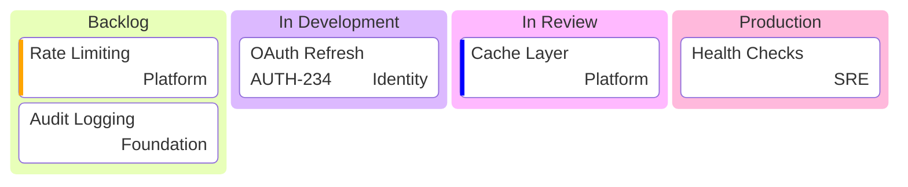

# Kanban Reference

**Use for**: Workflow state visualization, operational stages, service lifecycle tracking, team ownership

**Don't use for**: Active task tracking (use external tools), complex dependencies, real-time updates

---

## Basic Syntax



---

## Metadata



**Available metadata**:
| Field | Use for |
|-------|---------|
| `assigned` | Team/person ownership |
| `ticket` | External tracking ID |
| `priority` | Very High, High, Low, Very Low |

---

## Ticket Links

```yaml
---
config:
  kanban:
    ticketBaseUrl: 'https://project.atlassian.net/browse/#TICKET#'
---
```

Converts `ticket: ABC-123` into clickable link.

---

## Complete Example



---

## Best Practices

- Use for **documenting workflow states**, not tracking active work
- Show team ownership with `assigned` field
- Keep 3-5 columns
- Keep 10-15 total tasks max
- Apply metadata consistently (all or none)
- Remember: this is static documentation

---

## Common Mistakes

- Using for active work tracking (diagrams are static)
- Too many cards (>20 cluttered)
- Inconsistent metadata (some cards with fields, some without)
- Treating it as a live board

---

## Syntax Rules

- **Indentation required**: Tasks indented under columns
- **Metadata syntax**: `@{key: value, key: value}`
- **Priority values**: Only four predefined options
- **Static**: Does not update automatically

---

## Kanban vs Other Types

| Need | Use |
|------|-----|
| Document workflow stages | Kanban |
| Show dependencies | Gantt |
| Active sprint tracking | External tools (Jira) |
| State transitions | State diagram |
| Process with decisions | Flowchart |

---

*Kanban diagrams show WORKFLOW STAGES and OWNERSHIP as documentation.*
