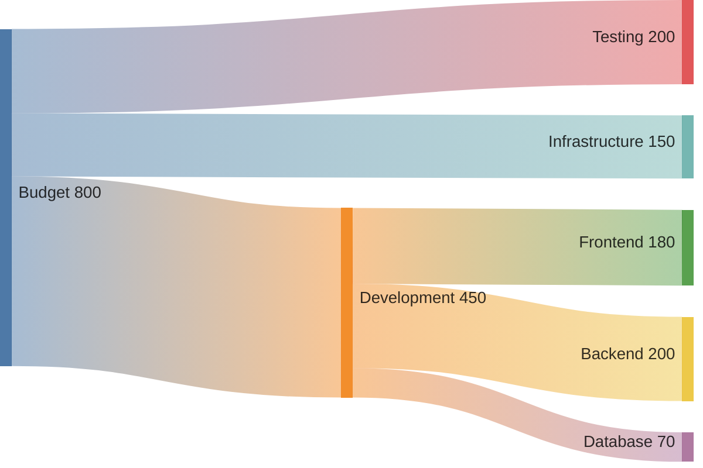

# Sankey Diagram Reference

**Use for**: Flow visualization, quantity movement, budget allocation breakdown

**Don't use for**: Circular flows, hierarchies (use treemap)

---

## Basic Syntax


*Format: Source,Target,Value (CSV)*

---

## Rules

- **CSV format**: `Source,Target,Value`
- **Positive values only**
- **No circular flows** (A→B→A breaks)
- Quote labels with commas: `"Name, Inc",Target,100`
- Keep 5-15 nodes
- Aggregate small flows (<5%) into "Other"

---

## Configuration

Hide values for cleaner visuals:

```yaml
---
config:
  sankey:
    showValues: false
---
```

---

## Best Practices

- Flow left-to-right (source → destination)
- Keep node count manageable (5-15)
- Aggregate small flows
- Use for showing where quantities go

---

## Common Mistakes

- Circular flows (breaks rendering)
- Too many nodes (>15)
- Tiny flows that aren't visible
- Unquoted labels containing commas

---

**Note**: Experimental (v10.3.0+) - syntax may evolve.

---

*Sankey diagrams show FLOW of quantities. Use for budgets, traffic, conversions.*
