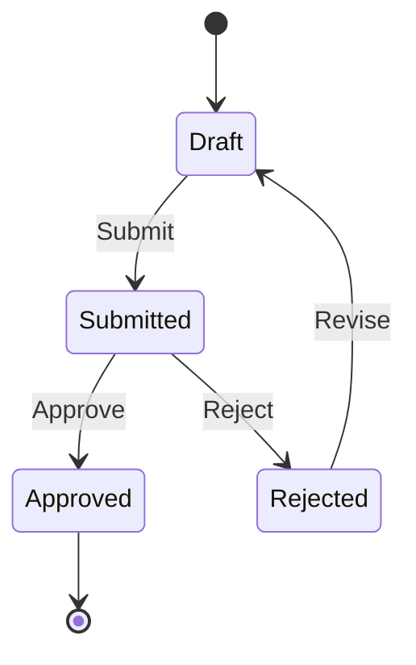
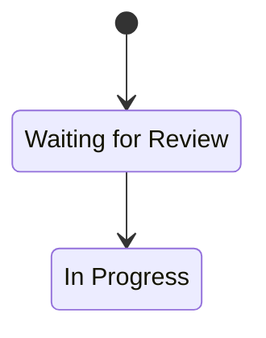
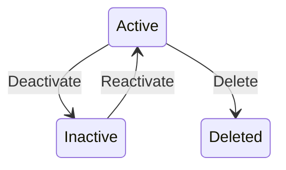
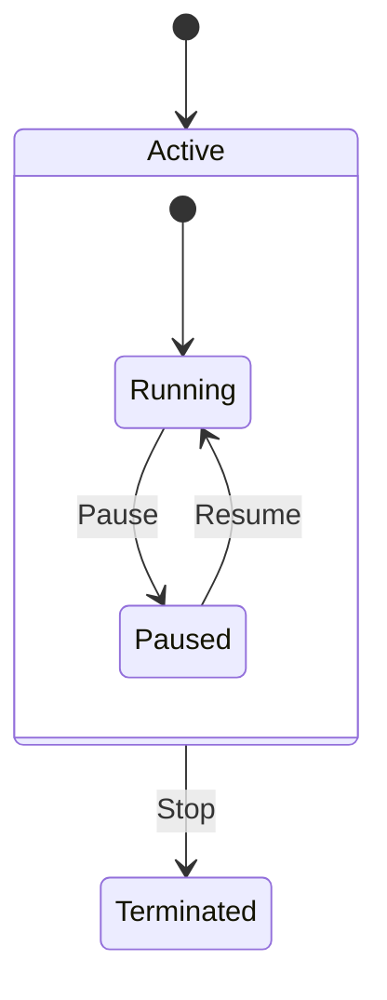
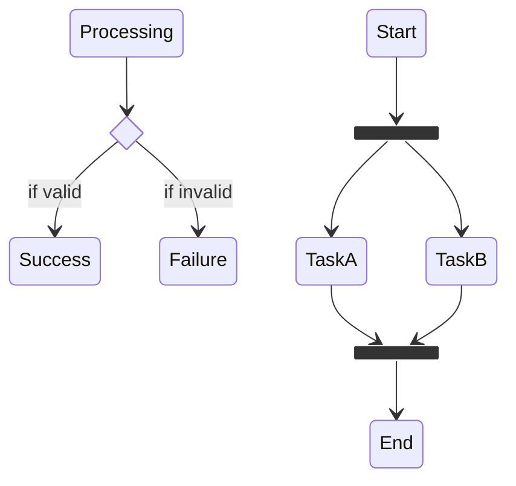
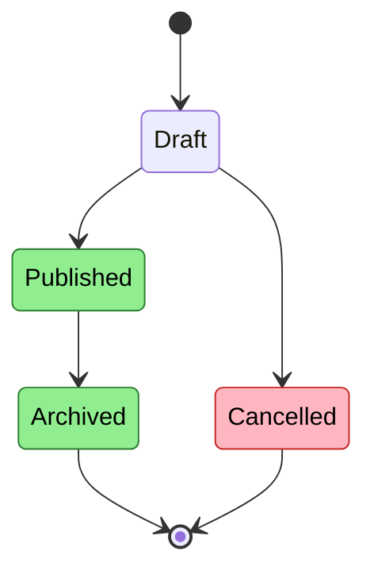
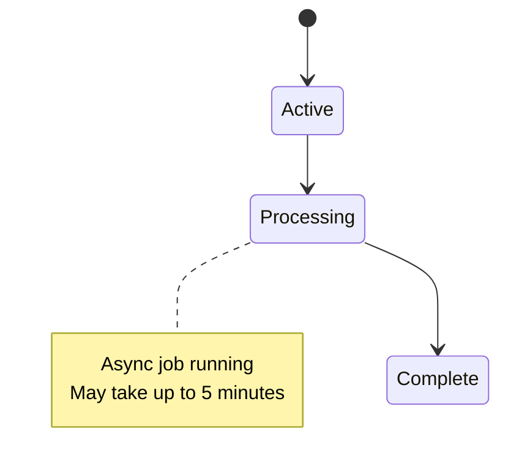

# State Diagram Reference

**Use for**: Lifecycle management, status transitions, state machines, workflow states

**Don't use for**: Static structure, one-time processes, linear sequences

---

## Basic Syntax

---

## State Declaration

- Use `state "Display Name" as id` for spaces in names
- Start/end marker: `[*]`

---

## Transitions

| Syntax | Meaning |
|--------|---------|
| `A --> B` | Transition from A to B |
| `A --> B: Label` | Labeled transition (trigger/action) |
| `[*] --> A` | Initial transition |
| `A --> [*]` | Terminal transition |

---

## Composite States

Nest states for complex hierarchies:

---

## Choice and Fork

| Marker | Use for |
|--------|---------|
| `<<choice>>` | Decision point |
| `<<fork>>` | Parallel split |
| `<<join>>` | Parallel merge |

---

## Styling States

*Colors: Green = success states, Red = rejection states*

**Note**: State diagrams use `class StateName className` syntax, not `:::className`.

---

## Notes

---

## Best Practices

- Show ALL valid transitions (completeness matters)
- Color terminal states (success vs failure)
- Label transitions with trigger events
- Include reverse transitions where valid
- Use composite states for related sub-states
- Mark start `[*] -->` and end `--> [*]` clearly

---

## Common Mistakes

- Missing reverse transitions (can you go back?)
- Incomplete state coverage (missing terminal states)
- Using for one-directional flow (use flowchart)
- No initial state marker
- Missing transition labels (what triggers each transition?)
- Using `:::` instead of `class` for styling

---

## State vs Flowchart

| Characteristic | State Diagram | Flowchart |
|----------------|---------------|-----------|
| Shows | Valid transitions | Process logic |
| Cycles | Common (back-edges) | Uncommon |
| Purpose | What states exist, how to move between them | How to process from start to end |
| Example | Order status lifecycle | Order processing logic |

**Rule**: If entities persist in states and transition between them, use state diagram. If it's a one-shot process, use flowchart.

---

*State diagrams show WHERE things can be and HOW they move between states.*
