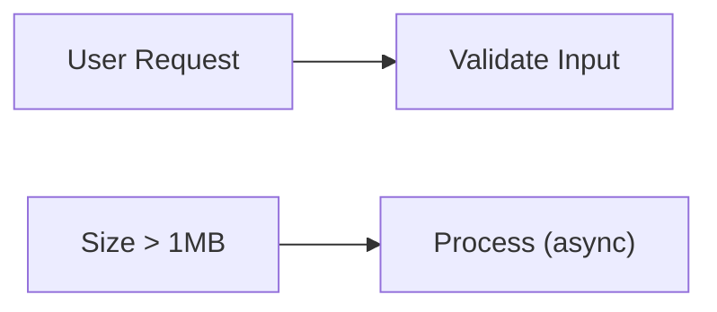
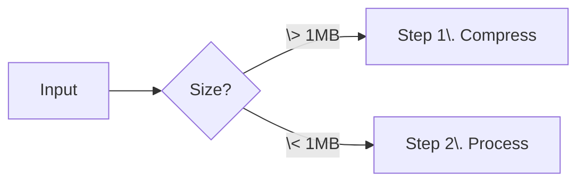
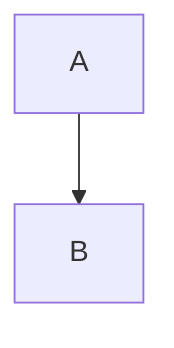
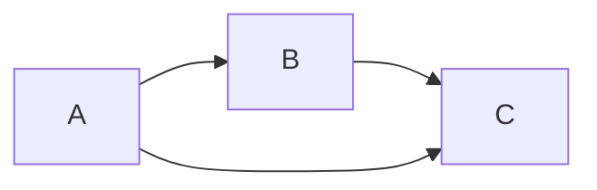
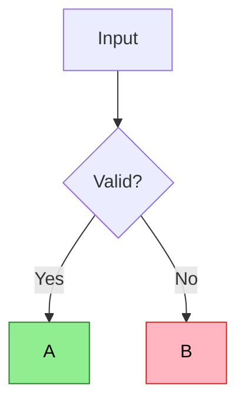
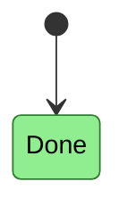
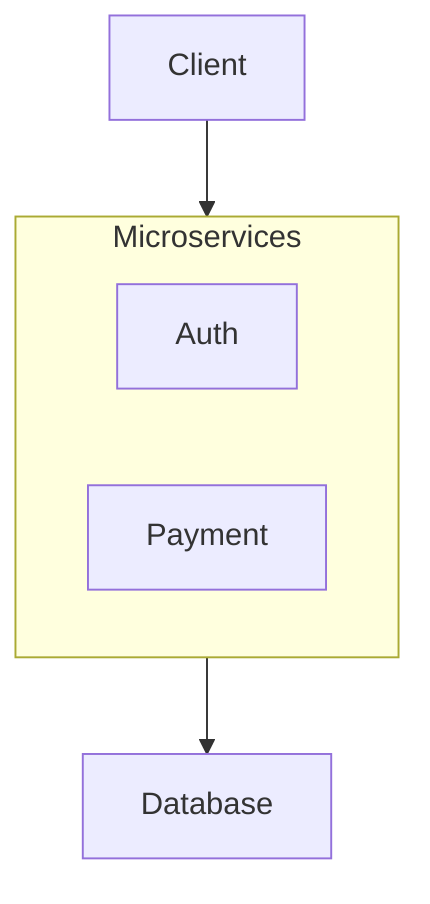

# Mermaid Syntax Reference

Cross-cutting syntax rules that apply to all diagram types.

---

## Quoting Labels

**Rule**: Labels with spaces or special characters MUST be quoted.



**Requires quotes**:
| Character | Example |
|-----------|---------|
| Spaces | `"User Request"` |
| Parentheses | `"Process (async)"` |
| Brackets | `"Array[0]"` |
| Colons | `"Key: Value"` |
| Commas | `"Name, Inc"` |
| Greater than | `"Size > 1MB"` |
| Less than | `"Count < 10"` |

---

## Escaping Markdown

**Rule**: Markdown syntax inside labels must be escaped.



| Character | Problem | Solution |
|-----------|---------|----------|
| `>` | Arrow syntax | `\>` or quote |
| `<` | Arrow syntax | `\<` or quote |
| `-` at start | List syntax | `\-` |
| `1.` at start | Numbered list | `1\.` |

**Never use list numbering in labels**:
```
A -->|1. Do thing| B     WRONG
A -->|Do thing| B        RIGHT
```

---

## Comments

Use `%%` for comments (invisible in output):



**Standard comment types**:
| Comment | Purpose |
|---------|---------|
| `MEANING` | What the diagram represents |
| `COLOR` | What colors signify (required if colors used) |
| `GOTCHA` | Edge cases omitted for clarity |
| `TIMING` | Sync/async/sequential behavior |
| `SYNTAX` | Mermaid-specific notes |

---

## Layout Engines

Default is `dagre`. Use `elk` for complex routing:

```yaml
---
config:
  layout: elk
---
flowchart TD
    A --> B
    A --> C
    B --> D
    C --> D
```

| Engine | Use when |
|--------|----------|
| dagre (default) | Simple graphs, 10 nodes |
| elk | Complex routing, many edges |

**ELK won't fix structural issues** (complete bipartite patterns).

---

## Direction Options

| Syntax | Direction |
|--------|-----------|
| `TD` / `TB` | Top to bottom |
| `LR` | Left to right |
| `BT` | Bottom to top |
| `RL` | Right to left |

**Tips**:
- `LR` works better for cascading decisions
- `TD` works better for process flows with shared sinks

---

## Node Declaration Order

Nodes are laid out roughly in declaration order.



To fix layout issues, try:
1. Change declaration order
2. Try different direction
3. Switch to ELK layout
4. Add intermediate nodes
5. Split into multiple diagrams

---

## Styling Classes


*Colors: Green = success, Red = error*

**Flowchart**: Use `:::className` inline



**State diagram**: Use `class StateName className` (not `:::`)

---

## Accessibility Requirements

**Non-negotiable**:
- Black text on light backgrounds (`color:#000`)
- 3:1 contrast minimum (WCAG AA)
- Never rely on color alone
- Always explain colors in comments

**Suggested palette**:
```css
--success: fill:#90EE90,stroke:#2E7D32,color:#000
--error: fill:#FFB6C1,stroke:#C62828,color:#000
--warning: fill:#FFE082,stroke:#F57C00,color:#000
--info: fill:#81D4FA,stroke:#0277BD,color:#000
```

---

## Configuration Block

```yaml
---
config:
  layout: elk
  theme: base
  xyChart:
    showValues: false
  sankey:
    showValues: false
---
```

Place at top of diagram, before diagram type declaration.

---

## Subgraphs



- Named with `subgraph id["Display Name"]`
- Can connect to entire subgraph
- End with `end`

---

## Edge Crossing Patterns

**Will cross** (structurally unavoidable):
- Notes on diverging branches
- Complete bipartite (N sources to M targets)
- Many-to-many connections

**Won't cross** (safe patterns):
- Simple diamonds (fan-out then rejoin)
- Decision trees (cascading if/else)
- Single back-edge cycles

**Fix attempts** (in order):
1. Change declaration order
2. Change direction (LR vs TD)
3. Use ELK layout
4. Add intermediate layer
5. Remove redundant sinks
6. Split into multiple diagrams

---

## Experimental Features

Some diagram types are in beta:

| Type | Version | Status |
|------|---------|--------|
| `architecture-beta` | v11.1.0+ | Experimental |
| `sankey-beta` | v10.3.0+ | Experimental |
| `treemap-beta` | v10.3.0+ | Experimental |
| `xychart-beta` | v10.0.0+ | Experimental |

Syntax may change in future versions.

---

*Syntax rules apply across all diagram types. Master these once.*
