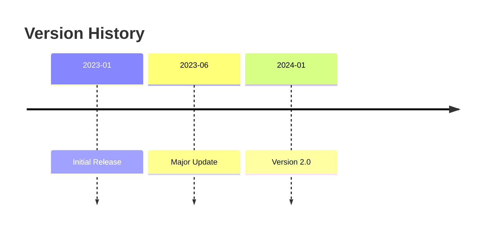
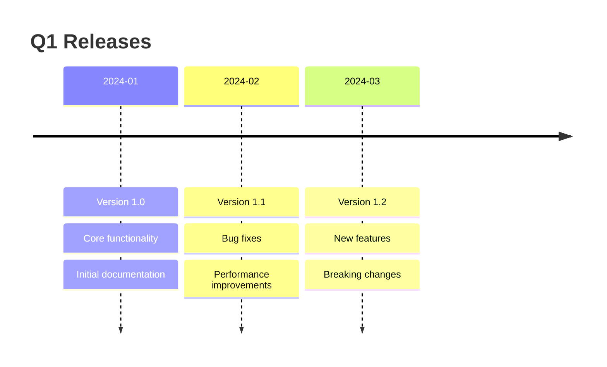
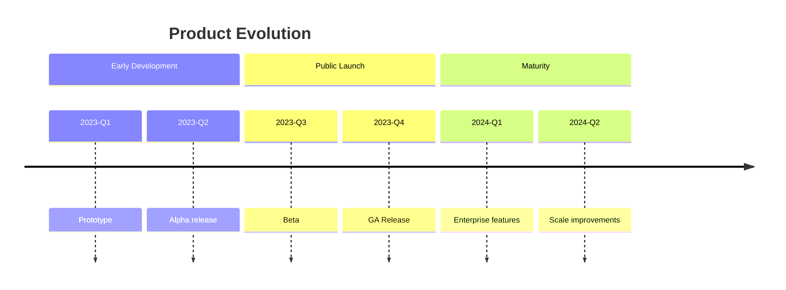
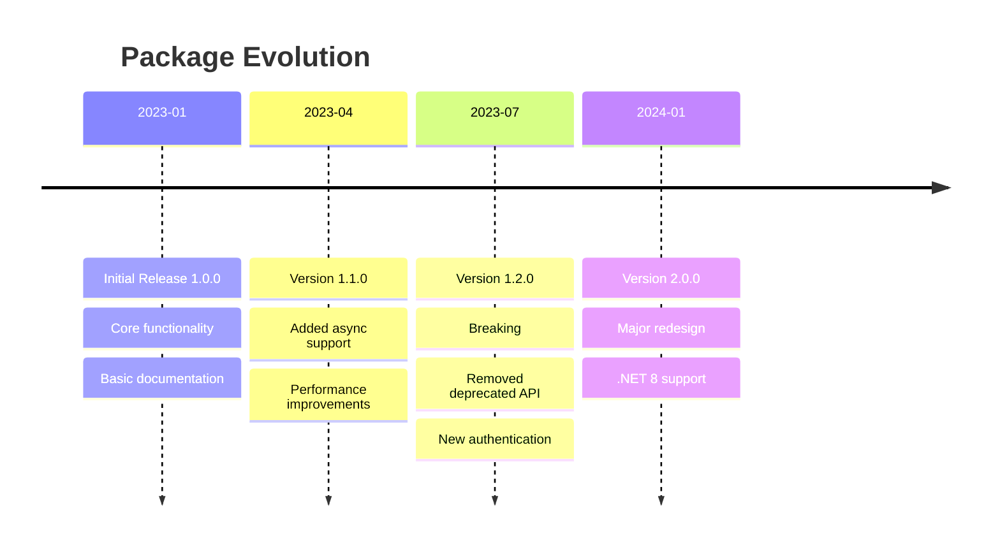

# Timeline Reference

**Use for**: Historical events, version releases, chronological milestones, evolution documentation

**Don't use for**: Future planning (use Gantt), process flows, dependencies

---

## Basic Syntax

---

## Multiple Events Per Period

---

## Section Grouping

---

## Complete Example

---

## Best Practices

- Consistent time intervals (months, quarters, years)
- Multiple events per period when related
- Highlight breaking changes clearly
- Keep descriptions concise (2-4 words)
- Use sections for phases
- Chronological order (oldest to newest)

---

## Common Mistakes

- Using for future planning (use Gantt)
- Inconsistent time granularity
- Too much detail per event
- No clear progression
- Missing significant milestones

---

## Timeline vs Gantt

| Aspect | Timeline | Gantt |
|--------|----------|-------|
| Purpose | Document history | Plan future |
| Dependencies | No | Yes |
| Duration bars | No | Yes |
| Multiple events | Yes | No |
| Use case | "What happened" | "What will happen" |

---

*Timelines show WHAT happened WHEN in chronological order.*
