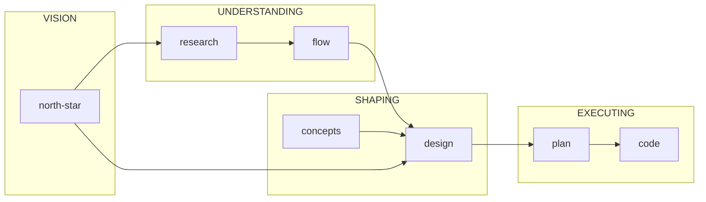

# Writing Documents

Wrong information is worse than missing information. One fabricated fact becomes gospel for every future agent. Prevent harm first, enable quality second.

---

## What Kind of Document?

| If the reader wants to... | Write a... | Key insight |
|---------------------------|------------|-------------|
| Know what great looks like | **north-star** | Vision that guides all downstream work |
| Understand something | **gestalt** | Essential essence, not everything |
| Look something up | **reference** | Data in CSV, guidance in markdown |
| Inform a decision | **research** | Synthesis without prescription |
| Know how to build it | **design** | "Yep, that will work" before code |
| Know what to build next | **plan** | Reviewed by humans, implemented by agents |
| See a process end-to-end | **flow** | Stages, actors, handoffs |
| Get a question answered | **findings** | Answer before evidence |
| Carry wisdom forward | **concepts** | Capsule format |
| Follow a procedure | **process** | High-agency (outcomes) or low-agency (steps) |

Each type has guidance in `references/{type}/`. Read it before writing.

---

## Before Writing

### Audience and Purpose

```yaml
---
description: One sentence - what this is and why it exists
tags: [searchable, terms]
audience: { human: 60, agent: 40 }
purpose: { north-star: 0, gestalt: 0, reference: 0, research: 0, design: 0, plan: 0, flow: 0, findings: 0, concepts: 0, high-agency-process: 0, low-agency-process: 0 }
---
```

Distribute 100 points for audience and 100 for purpose. Dominant purpose determines which guidance to follow.

**Required**: Read at least your dominant audience guide before writing. Read both if blended.
- `references/audiences/agent.md`
- `references/audiences/human.md`

**Example**: Communication service documentation

```
docs/communication/
├── README.md                           # gestalt:90 reference:10        human:70 agent:30
├── gestalt.md                          # gestalt:100                    agent:100  ← max info/token
├── configuration.md                    # reference:85 low-agency:15     human:40 agent:60
├── error-codes.md                      # reference:80 gestalt:20        human:60 agent:40
├── error-codes.csv
│
├── research/
│   ├── esp-comparison.md               # research:90 reference:10       human:50 agent:50
│   ├── deliverability-factors.md       # research:70 concepts:30        human:40 agent:60
│   └── inbox-placement-2024.md         # research:85 findings:15        human:60 agent:40
│
├── flows/
│   ├── sending.md                      # flow:80 gestalt:20             human:70 agent:30
│   ├── bounce-handling.md              # flow:85 reference:15           human:60 agent:40
│   └── suppression.md                  # flow:70 reference:30           human:50 agent:50
│
├── designs/
│   ├── architecture.md                 # design:75 gestalt:25           human:55 agent:45
│   ├── batch-processor.md              # design:90 flow:10              human:45 agent:55
│   └── adr/
│       └── 001-ses-over-sendgrid.md    # design:60 research:40          human:70 agent:30
│
├── plans/
│   └── rate-limiting.md                # plan:95 design:5               human:30 agent:70
│
├── runbooks/
│   ├── incident-response.md            # low-agency:90 reference:10     human:80 agent:20
│   └── ip-warmup.md                    # low-agency:70 research:30      human:60 agent:40
│
└── troubleshooting/
    ├── gmail-rejections.md             # findings:70 reference:30       human:50 agent:50
    └── debugging-templates.md          # reference:50 low-agency:50     human:65 agent:35
```

---

## Hard Rules

### Only Record What You Can Verify

Evidence hierarchy:
1. 📄 Code — directly observed
2. 📚 Docs — stated in documentation
3. 🧠 Synthesis — derived from verified sources
4. 👤 User — confirmed by expert
5. 💭 Intuition — feels right, but I can't prove it

### When in Doubt, Omit

Missing prompts research. Wrong causes bad decisions.

### Never Write

| Pattern | Problem |
|---------|---------|
| Timestamps | Git tracks; becomes misleading |
| "Currently" | Will become false |
| "Planned for" | Plans change |
| Estimates | Always wrong |
| Speculation about intent | Often wrong |

Mark gaps honestly: `**STUB** - needs expert input`

---

## Purpose Guidance

### North Star
**Declare what great looks like. Guide all downstream work.**

The vision document that comes first. Describes the ideal from the user's perspective—capabilities, not implementation. Ancestor to many designs; each design's north star section is a shallow slice of the ancestor.

→ `references/north-star/north-star.md`

### Gestalt
**Re-hydrate understanding. Enable good instincts.**

Essential essence in first paragraph. 2-4 concepts that unlock understanding. Pointers to depth, not duplication. After reading: can you UNDERSTAND, not just navigate?

→ `references/gestalt/gestalt.md`

### Reference
**Data in CSV. Guidance in markdown.**

Enumerate finite sets; teach discovery for infinite sets. Every entry needs "When NOT to use."

→ `references/reference/reference.md`

### Research
**Synthesis without prescription.**

"Fastest in benchmarks" is synthesis. "You should use X" is prescription. Purpose first — if you don't know what the downstream goal of this research is, ask.

→ `references/research/research.md`

### Design

**Enables "Yep, that will work" before any code.**

Establish north star. Check inputs: research, flows, gaps. Primary job: contain complexity, bring flows, research and design goals together into a coherent architecture.

→ `references/design/design.md`

### Plan

**Reviewed by humans. Implemented by agents.**

Specific scope and done criteria, implementation left to judgment. EARS syntax for testable requirements. Enables section shows what becomes possible. Delete when complete.

→ `references/plan/plan.md`

### Flow
**Stages, actors, handoffs.**

Descriptive, not prescriptive. Concrete enough to discuss, abstract enough to leave implementation open. Use before design to find cross-cutting concerns.

→ `references/flow/flow.md`

### Findings
**Answer the question. Answer before evidence.**

Question at top, answer front-loaded, sources near claims. No speculation, no timelines, no unsolicited recommendations.

→ `references/findings/findings.md`

### Concepts
**Crystallized wisdom in capsule format.**

Capsules are powerful because they're token-efficient, timeless, and composable. The invariant forces precision — if you can't compress it to one line, you may not understand it yet. Agents can select and combine capsules without averaging conflicting ideas.

Must read the capsule specification in full before writing.

→ `references/concepts/capsules.md`

### Process
**High-agency**: 

Prescribe outcomes, trust agent to color between the lines. Flexible, generalizable and relies heavily on agent judgment and intelligence.
**Low-agency**: 

Skip or reorder causes harm. Strong guardrails. Scripted steps with verification.

→ `references/high-agency-process/high-agency-process.md`, `references/low-agency-process/low-agency-process.md`

---

## How Documents Support Each Other



| Document | Feeds into | When to use |
|----------|------------|-------------|
| north-star | research, flow, design | Declaring what great looks like |
| research | flow, design, *ambient knowledge* | Exploring options, building domain expertise |
| flow | design | Mapping processes |
| concepts | design | Crystallizing wisdom |
| design | plan | Defining architecture |
| plan | code | Scoping work |
| gestalt | *any stage* | Re-hydrating understanding |
| reference | *any stage* | Looking up facts |
| findings | *any stage* | Answering questions |

North star is the ancestor—one north star may guide many designs. Research explores what's possible within the vision. Flow maps how it should work. Design makes trade-offs against the north star.

A design without north star lacks a target to evaluate against. A design without flow misses how it will actually be used. A plan without design lacks grounding and the big picture.

---

## After Writing

### Rewrite as Cohesive Whole

Edits accumulate. Each patch respects existing structure even when structure no longer serves content. Editing asks "what's wrong?" Writing asks "what should this be?"

**The technique**:
1. Read the original fully
2. Replace content with `*Replacing with a reformulated cohesive whole after deep thought*`
3. Write fresh

The placeholder clears your mental slate. You've absorbed the content; now write what it should be, not what it was.

---

## Checklist

- [ ] Frontmatter complete with audience and purpose scores
- [ ] Dominant purpose guidance read and followed
- [ ] Only verified information; gaps marked honestly
- [ ] No timestamps, "currently", estimates, speculation
- [ ] Findable, trustworthy, maintainable
- [ ] Rewritten as cohesive whole
- [ ] Limited 'Claude-isms'

---

*Wrong information is worse than missing information.*
