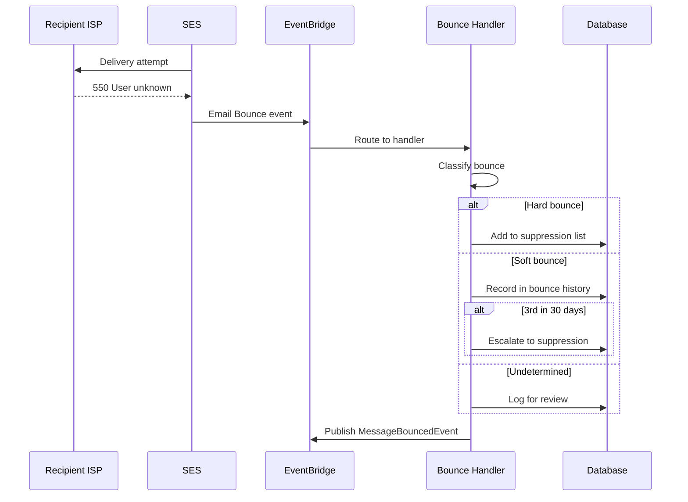

# Email Bounce Flow

What happens when an email can't be delivered—from ISP rejection through suppression.

## Why This Matters

Bounces signal delivery failures. Ignoring them damages sender reputation and wastes resources.

| Without handling | With handling |
|------------------|---------------|
| ISPs see repeated failures → block you | Bad addresses removed → clean list |
| Emails land in spam | Emails reach inbox |
| Pay to send to dead addresses | Only pay for valid sends |

## Trigger

SES publishes an `Email Bounce` event to EventBridge when a recipient ISP rejects delivery.

## Stages

### 1. ISP Rejection
**Actor**: Recipient ISP
**Action**: Rejects delivery with SMTP code
**Output**: Bounce notification to SES
**Failure**: May be immediate (sync) or delayed hours (async NDR)

### 2. SES Event Publication
**Actor**: AWS SES
**Action**: Publishes structured bounce event to EventBridge
**Output**: Event with bounce type, recipient, diagnostic code

```json
{
  "detail-type": "Email Bounce",
  "source": "aws.ses",
  "detail": {
    "bounce": {
      "bounceType": "Permanent",
      "bounceSubType": "NoEmail",
      "bouncedRecipients": [{
        "emailAddress": "user@example.com",
        "diagnosticCode": "smtp; 550 5.1.1 User unknown"
      }]
    },
    "mail": {
      "tags": {
        "messageId": ["our-internal-id"],
        "organisation": ["org_abc123"]
      }
    }
  }
}
```

### 3. Bounce Classification
**Actor**: Bounce Handler
**Action**: Classifies bounce by permanence
**Output**: Classification determining suppression action

| Type | SES Value | Meaning | Action |
|------|-----------|---------|--------|
| Hard | `Permanent` | Address doesn't exist | Suppress immediately |
| Soft | `Transient` | Temporary issue | Track; suppress after 3 in 30 days |
| Undetermined | `Undetermined` | Unknown | Log for review, no suppression |

### 4. Suppression Decision
**Actor**: Bounce Handler
**Action**: Updates suppression list based on classification
**Output**: Address suppressed or bounce history recorded
**Failure**: If DB unavailable, EventBridge retries (3 attempts, 1 hour max)

### 5. Event Publication
**Actor**: Bounce Handler
**Action**: Publishes `MessageBouncedEvent` as CloudEvent
**Output**: Downstream systems notified

```json
{
  "type": "com.acme.communication.MessageBounced",
  "data": {
    "messageId": "our-internal-id",
    "recipientEmail": "user@example.com",
    "bounceType": "Permanent",
    "bounceSubType": "NoEmail"
  }
}
```

## Termination

Flow completes when:
- Suppression list updated (hard bounce) or bounce history recorded (soft/undetermined)
- Message counts incremented
- Downstream event published
- Idempotency key stored (7-day TTL)

## Flow Diagram



## Error Handling

| Error | Behaviour |
|-------|-----------|
| Database unavailable | EventBridge retries |
| Message not found | Log warning, skip |
| All retries exhausted | DLQ for manual review |

## Timing

| Phase | Duration |
|-------|----------|
| SES → ISP attempt | Immediate to minutes |
| ISP rejection | Immediate or hours (async) |
| Event to handler | ~100ms P99 |
| Handler processing | ~50ms |

## Verification

| Environment | How |
|-------------|-----|
| **Local** | LocalStack doesn't generate bounce events. Publish directly to EventBridge (see below) |
| **Automated tests** | Inject SES event JSON into handler. Assert suppression record created, downstream event published |
| **Production** | `email.bounced` counter by bounce type. Alert on sustained spike. DLQ depth for failures |

**Local simulation:**

```bash
aws --endpoint-url=http://localhost:4566 events put-events \
  --entries '[{
    "Source": "aws.ses",
    "DetailType": "Email Bounce",
    "Detail": "{\"bounce\":{\"bounceType\":\"Permanent\",\"bouncedRecipients\":[{\"emailAddress\":\"test@example.com\"}]},\"mail\":{\"tags\":{\"messageId\":[\"test-123\"]}}}",
    "EventBusName": "communication-events"
  }]'
```

**Staging:** SES mailbox simulator addresses (no reputation impact):

| Address | Simulates |
|---------|-----------|
| `bounce@simulator.amazonses.com` | Hard bounce |
| `ooto@simulator.amazonses.com` | Soft bounce |

## Related

- Suppression schema: `design/communication/suppression.md`
- Quarantine flow: `flows/email/quarantine.md` (high bounce rates)
- Send flow: `flows/email/sending.md` (checks suppression before send)
