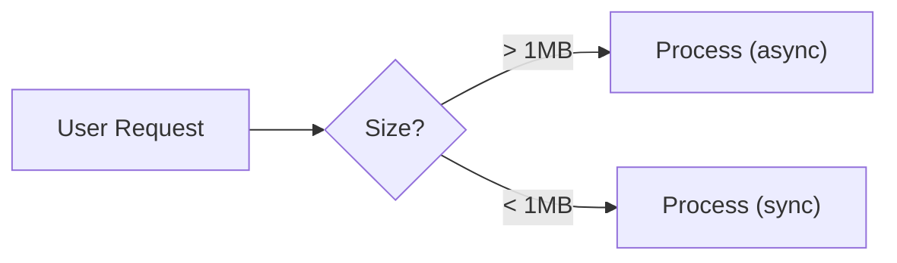
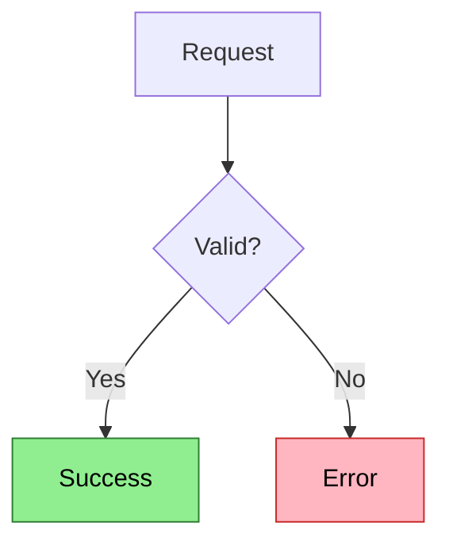

# Mermaid Diagrams

Diagrams reveal relationships that prose cannot express efficiently. Before creating one, ask if a list or table would work.

## The Cardinal Rule

**Never diagram linear sequences.**

```
A --> B --> C --> D
```

This is a list pretending to be a diagram. Use a numbered list instead.

**Test**: If there are no branches, decisions, or parallel paths, use a list.

---

## Capsule: DiagramValue

**Invariant**
A diagram earns its place only when it reveals relationships or patterns that would require paragraphs to explain.

**Example**
Request flows through validation, cache check, and database lookup with error handling at each branch. A flowchart shows all paths instantly; prose would need three paragraphs.
//BOUNDARY: If deleting the diagram loses no critical information, delete it.

**Depth**
- Good diagrams: reveal patterns, show multiple dimensions, enable instant recognition
- Bad diagrams: waste tokens, add complexity without clarity, look impressive but convey little
- Test: Can you explain it faster with a list or table? If yes, use those.

---

## Capsule: SyntaxSafety

**Invariant**
Quote labels containing spaces or special characters; escape markdown syntax in labels.

**Example**

//BOUNDARY: Unquoted labels with spaces break rendering.

**Depth**
- Requires quotes: spaces, parentheses, brackets, colons, commas
- Requires escaping: `>`, `<`, `-` at start, `1.` at start
- Never use list numbering (`1. 2. 3.`) in labels - breaks Mermaid syntax
- SeeAlso: `references/syntax.md`

---

## Capsule: MeaningComments

**Invariant**
Document diagram meaning for both Claude (in `%%` comments) and users (in visible text or legend).

**Example**

*Colors: Green = success path, Red = error path*

**Depth**
- `%%` comments: For Claude's context (invisible in rendered output)
- Markdown text below diagram: For users viewing rendered output
- Both are needed when colors carry meaning
- Standard comments: MEANING, COLOR, GOTCHA, TIMING, NAVIGATION

---

## Choosing the Right Diagram

| Need | Use | Reference |
|------|-----|-----------|
| Process with branches/decisions | Flowchart | `references/flowchart.md` |
| Multi-party interactions over time | Sequence | `references/sequence.md` |
| State transitions | State diagram | `references/state.md` |
| Database schema | ER diagram | `references/er-diagram.md` |
| Code class hierarchy | Class diagram | `references/class.md` |
| Project schedule | Gantt chart | `references/gantt.md` |
| Historical events | Timeline | `references/timeline.md` |
| Concept hierarchy | Mindmap | `references/mindmap.md` |
| Quantity flows | Sankey | `references/sankey.md` |
| Proportions (3-7 items) | Pie chart | `references/pie.md` |
| Prioritization (2D) | Quadrant chart | `references/quadrant.md` |
| Trend/metric data | XY chart | `references/xy-chart.md` |
| Service topology (20+) | Architecture | `references/architecture.md` |
| Hierarchical proportions | Treemap | `references/treemap.md` |
| Workflow stages | Kanban | `references/kanban.md` |

**Decision tree in your head**:
1. Linear sequence? Use a list.
2. Shows relationships? Proceed.
3. What type of relationship? (Process, interaction, structure, time, concept)
4. Consult reference file for that type.

---

## Accessibility Requirements

**Non-negotiable**:
- Black text on light backgrounds (`color:#000`)
- 3:1 contrast minimum (WCAG AA)
- Never rely on color alone - use shapes, labels, borders
- Always explain colors in comments
- Test in both light and dark mode

**Suggested semantic palette**:
```css
--success: fill:#90EE90,stroke:#2E7D32,color:#000
--error: fill:#FFB6C1,stroke:#C62828,color:#000
--warning: fill:#FFE082,stroke:#F57C00,color:#000
--info: fill:#81D4FA,stroke:#0277BD,color:#000
```

---

## Quick Validation

Before committing:
- [ ] No linear sequences (use list instead)
- [ ] Labels with spaces are quoted
- [ ] Colors explained in comments
- [ ] Not relying on color alone
- [ ] <12 nodes (split if larger)
- [ ] Right diagram type for content

---

## Reference Files

Consult for specific diagram types:
- **`references/flowchart.md`** - Process with branches/decisions
- **`references/sequence.md`** - Multi-party interactions
- **`references/state.md`** - State transitions
- **`references/er-diagram.md`** - Database schema
- **`references/class.md`** - OOP hierarchies
- **`references/gantt.md`** - Project schedules
- **`references/timeline.md`** - Historical events
- **`references/mindmap.md`** - Concept hierarchies
- **`references/pie.md`** - Proportions (3-7 items)
- **`references/xy-chart.md`** - Trends and metrics
- **`references/quadrant.md`** - 2D prioritization
- **`references/sankey.md`** - Quantity flows
- **`references/treemap.md`** - Hierarchical proportions
- **`references/architecture.md`** - Service topology
- **`references/kanban.md`** - Workflow stages
- **`references/syntax.md`** - Quoting, escaping, layout engines

---

*Diagrams are expensive. Make them earn their place.*
