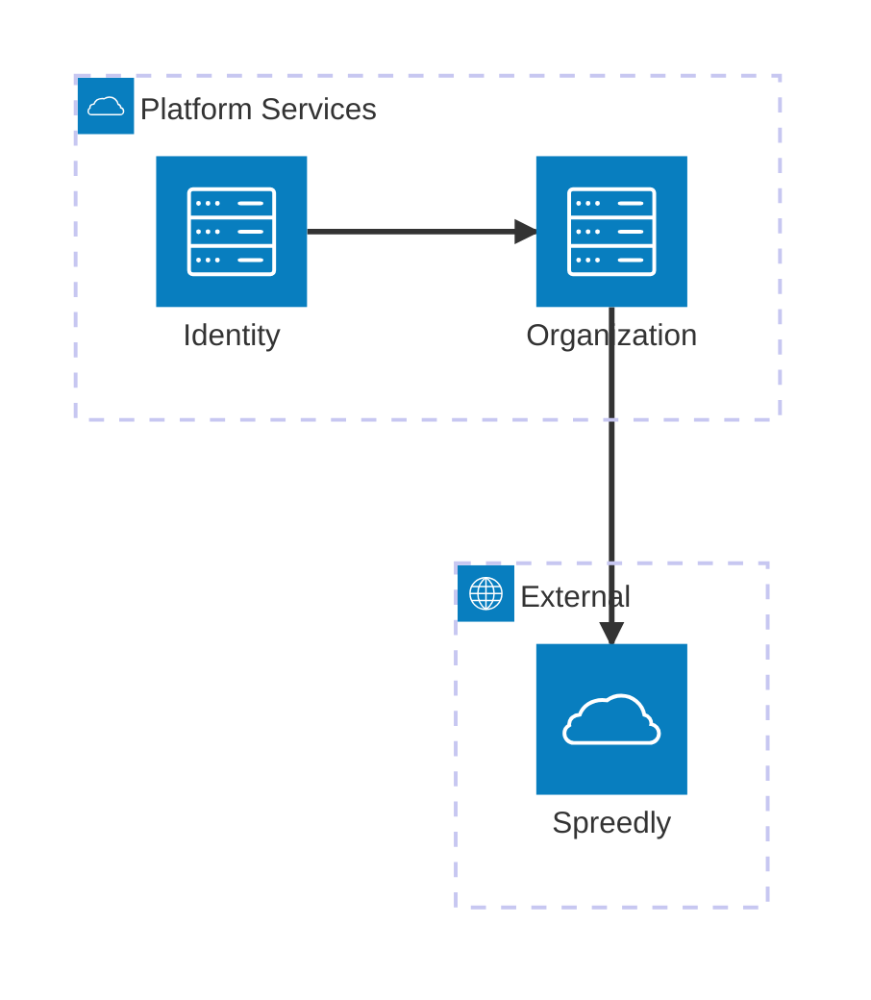
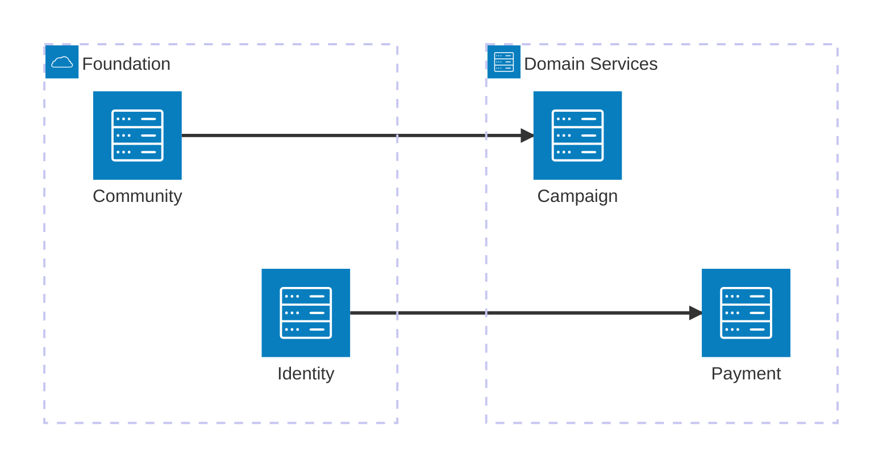
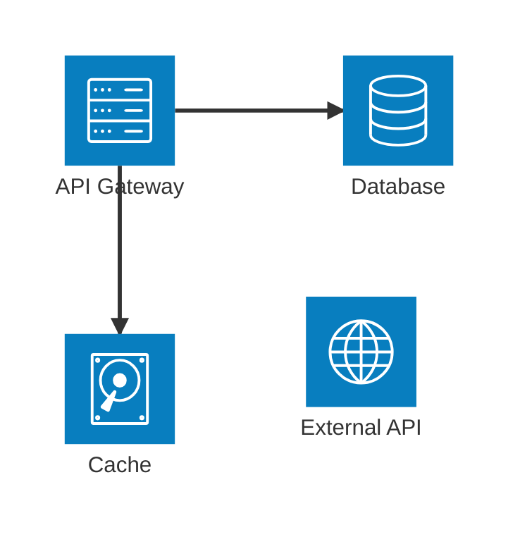
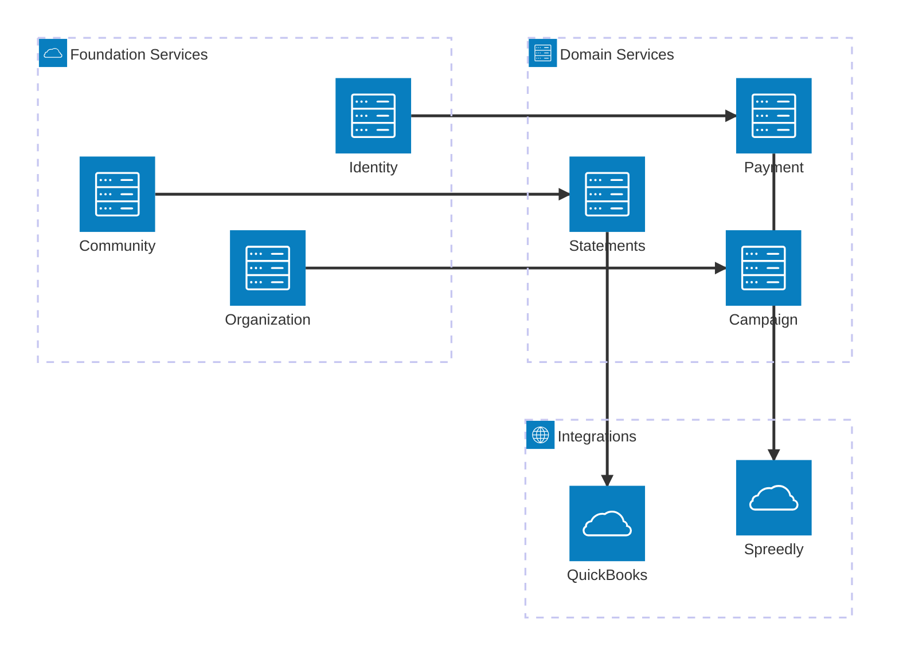

# Architecture Diagram Reference

**Use for**: Service topology (20+ services), infrastructure dependencies, explicit directional flows, hierarchical grouping

**Don't use for**: Simple trees (<10 nodes - use flowchart), data flows (use Sankey), sequences (use sequence diagram)

---

## Basic Syntax



---

## Groups



**Group syntax**: `group id(icon)[Display Name]`

---

## Services



**Service syntax**: `service id(icon)[Display Name] in groupId`

---

## Built-in Icons

| Icon | Use for |
|------|---------|
| `cloud` | Cloud services |
| `database` | Data stores |
| `disk` | Storage/cache |
| `internet` | External systems |
| `server` | Services |

---

## Edge Directions

```mermaid
architecture-beta
    service a(server)[A]
    service b(server)[B]

    a:T --> B:b
    a:B --> T:b
    a:L --> R:b
    a:R --> L:b
```

| Direction | Meaning |
|-----------|---------|
| `T` | Top |
| `B` | Bottom |
| `L` | Left |
| `R` | Right |

**Syntax**: `source:SourceDir --> TargetDir:target`

---

## Group-Level Connections

Connect entire groups:

```mermaid
architecture-beta
    group internal(cloud)[Internal]
    group external(internet)[External]

    service api(server)[API] in internal
    service worker(server)[Worker] in internal
    service vendor(cloud)[Vendor] in external

    internal:R --> L:external
```

Use `{group}` modifier for group-level edges.

---

## Complete Example



---

## Best Practices

- Use groups for layers/domains/teams
- Explicit direction on all edges
- Declare services before edges
- 10-20 services per diagram max
- Split larger systems into multiple diagrams
- Built-in icons for consistent styling

---

## Common Mistakes

- Edges before declarations (must declare first)
- Missing direction modifiers (`api --> db` fails)
- Too many nodes (>25 unreadable)
- No grouping (loses structure benefit)
- Using for simple topologies (<10 nodes - use flowchart)

---

## Architecture vs Flowchart

| Aspect | Architecture | Flowchart |
|--------|--------------|-----------|
| Grouping | Built-in | Subgraphs |
| Edge direction | Explicit | Implicit |
| Scale | 20+ services | <15 nodes |
| Purpose | Topology | Process |

---

**Note**: Experimental (v11.1.0+) - syntax may evolve.

---

*Architecture diagrams show SERVICE TOPOLOGY with explicit grouping and direction.*
