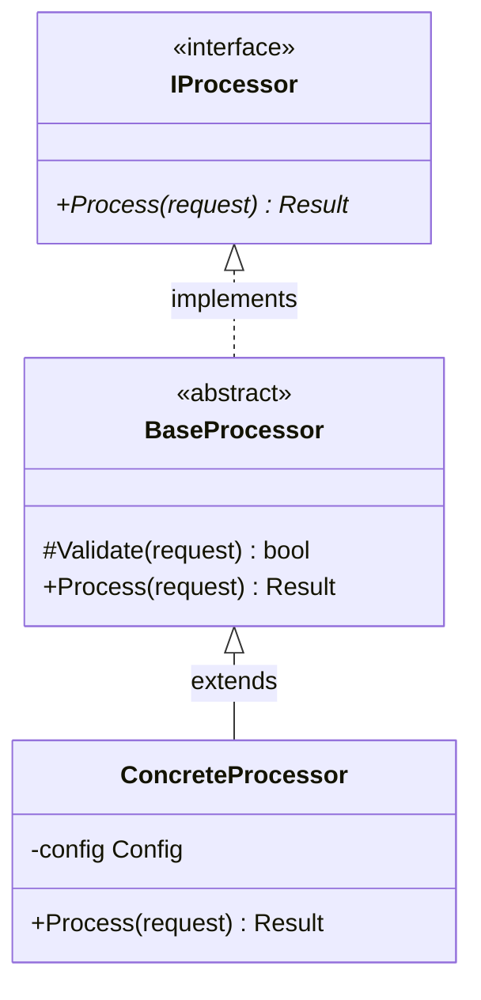
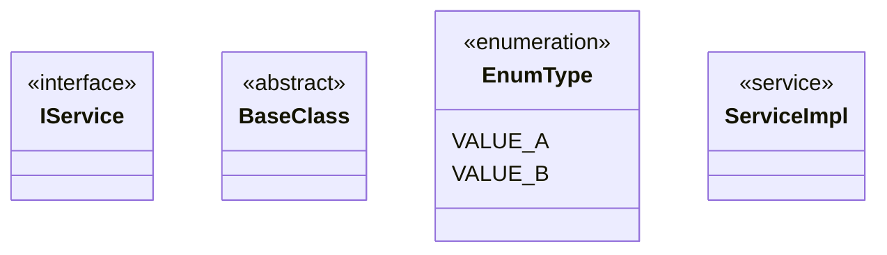
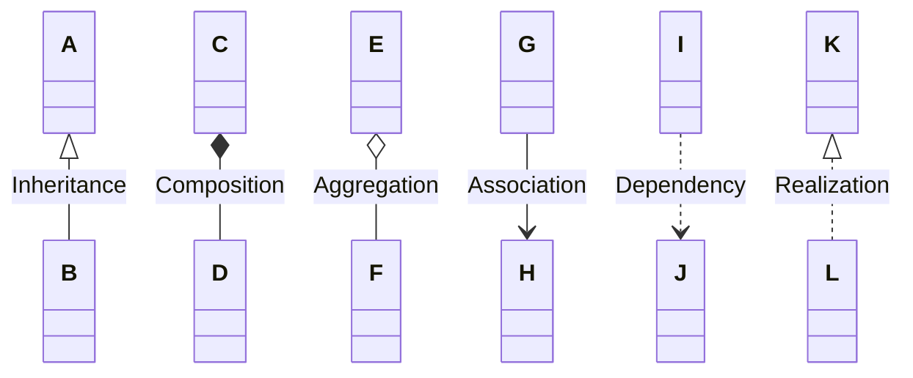
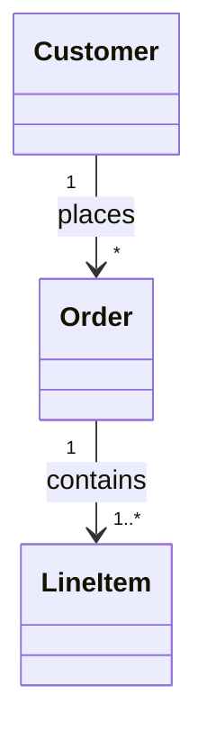
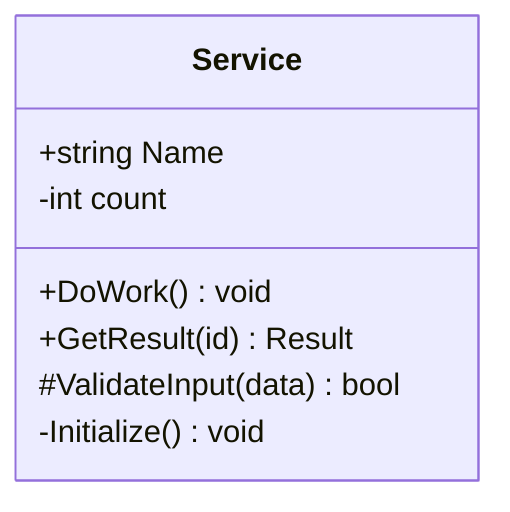
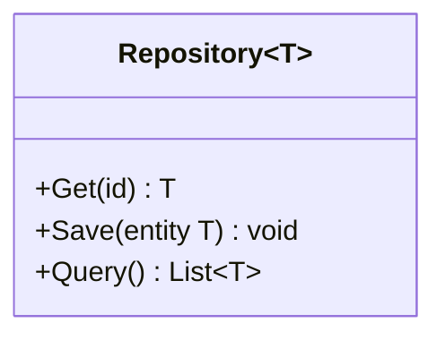
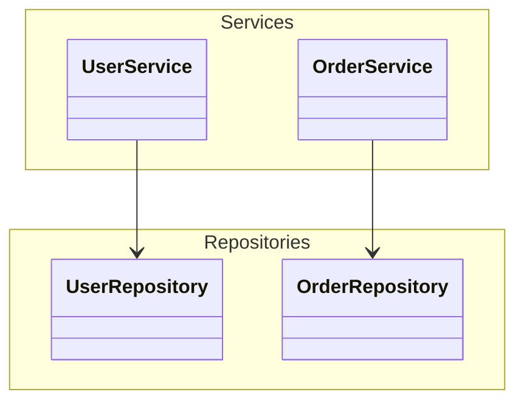

# Class Diagram Reference

**Use for**: Object-oriented design, inheritance hierarchies, interface contracts, API surface design

**Don't use for**: Database schema (use ER diagram), instances, data flow

---

## Basic Syntax

---

## Visibility Modifiers

| Symbol | Meaning |
|--------|---------|
| `+` | Public |
| `-` | Private |
| `#` | Protected |
| `~` | Package/internal |
| `*` | Abstract |

---

## Stereotypes

Common stereotypes: `interface`, `abstract`, `enumeration`, `service`, `record`

---

## Relationships

| Symbol | Meaning | Use for |
|--------|---------|---------|
| `<\|--` | Inheritance | Class extends class |
| `<\|..` | Realization | Class implements interface |
| `*--` | Composition | Part cannot exist without whole |
| `o--` | Aggregation | Part can exist independently |
| `-->` | Association | Reference/uses |
| `..>` | Dependency | Temporary use |

---

## Cardinality

| Notation | Meaning |
|----------|---------|
| `1` | Exactly one |
| `0..1` | Zero or one |
| `*` | Zero or more |
| `1..*` | One or more |
| `n` | Specific number |

---

## Methods and Properties

Format: `visibility name(params) returnType`

---

## Generic Types

Use `~T~` for generic type parameters.

---

## Namespaces

---

## Best Practices

- Use stereotypes (`<<interface>>`, `<<abstract>>`)
- Show visibility (`+`, `-`, `#`)
- Include key methods with return types
- Keep to 8 classes max per diagram
- Focus on API surface, not implementation details
- Use namespaces for logical grouping

---

## Common Mistakes

- Too much implementation detail (methods not relevant to design)
- Too many classes (>10 becomes unreadable)
- Using for database tables (use ER diagram)
- Missing stereotypes on interfaces/abstracts
- Missing visibility modifiers
- No relationship labels

---

## Class vs ER Diagram

| Aspect | Class Diagram | ER Diagram |
|--------|---------------|------------|
| Focus | Code structure | Data storage |
| Methods | Yes | No |
| Inheritance | Common | Rare |
| Cardinality | Optional | Required |
| Primary use | API design | Schema design |

---

*Class diagrams show WHAT the code structure looks like before implementation.*
