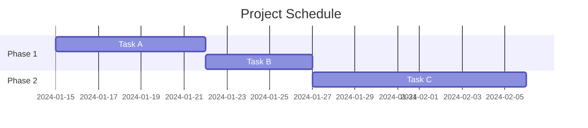
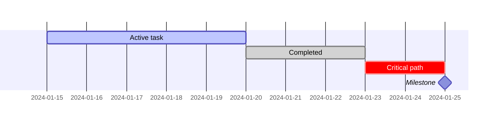
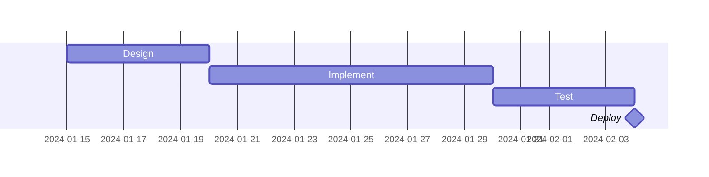
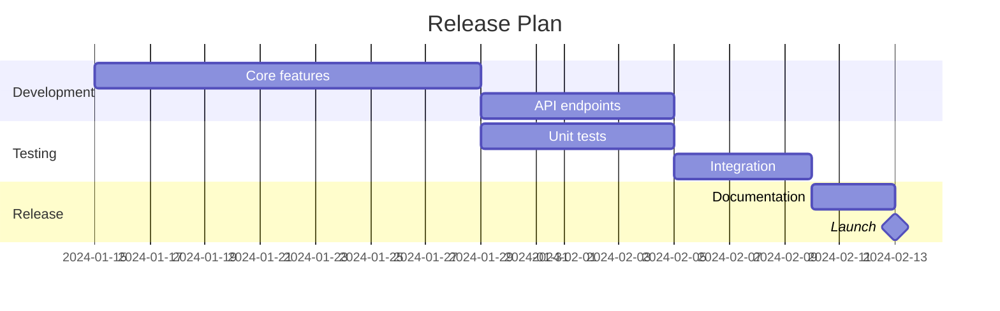
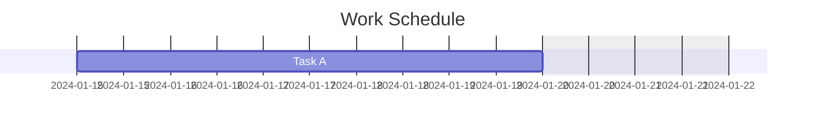
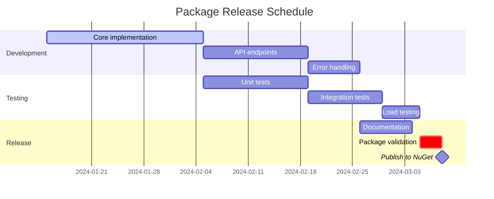

# Gantt Chart Reference

**Use for**: Project schedules, task dependencies, milestone tracking, release planning

**Don't use for**: Historical events (use timeline), process flows (use flowchart)

---

## Basic Syntax



---

## Date Formats

| Format | Example |
|--------|---------|
| `YYYY-MM-DD` | 2024-01-15 |
| `DD-MM-YYYY` | 15-01-2024 |
| `YYYY-MM-DD HH:mm` | 2024-01-15 09:00 |

Declare at top: `dateFormat YYYY-MM-DD`

---

## Task Syntax

```
TaskName    :id, startDate, duration
TaskName    :id, after otherId, duration
TaskName    :status, id, startDate, duration
```

**Duration units**: `d` (days), `w` (weeks), `h` (hours)

---

## Task States



| Status | Meaning |
|--------|---------|
| `active` | Currently in progress |
| `done` | Completed |
| `crit` | Critical path (highlighted) |
| `milestone` | Zero-duration marker |

---

## Dependencies



Use `after taskId` to create dependencies.

---

## Sections

Group related tasks:



---

## Excluding Days



Options: `weekends`, `saturday`, `sunday`, or specific dates.

---

## Complete Example



---

## Best Practices

- Mark critical tasks with `crit`
- Use sections to group related work
- Show dependencies with `after taskId`
- Mark milestones with zero duration
- Use realistic durations
- Name tasks descriptively

---

## Common Mistakes

- Using for historical timeline (use timeline diagram)
- No dependencies shown (everything looks parallel)
- Unrealistic durations
- Missing milestones
- Too many tasks (split into phases)
- No critical path identification

---

## Gantt vs Timeline

| Aspect | Gantt | Timeline |
|--------|-------|----------|
| Purpose | Future planning | Past events |
| Dependencies | Yes | No |
| Duration | Yes | No |
| Use case | Project schedule | Version history |

---

*Gantt charts show WHEN things happen and WHAT depends on what.*
