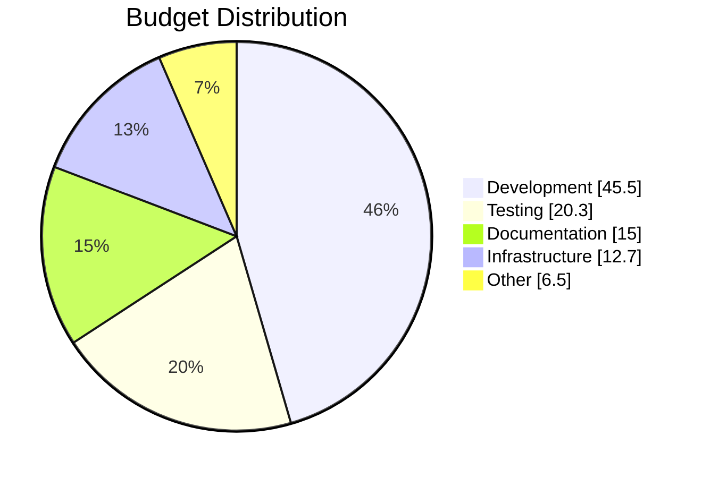

# Pie Chart Reference

**Use for**: Parts of whole (3-7 categories only)

**Don't use for**: Trends, >7 categories, precise comparisons

---

## Basic Syntax

*Slices ordered largest to smallest*

---

## Rules

- **3-7 slices max** (more becomes rainbow noise)
- Values must be positive
- Labels must be quoted
- Order by size (largest first)
- Group items <5% into "Other"
- Consider if table would be clearer

---

## Best Practices

- Always include a title
- Use `showData` to display values
- Keep labels short
- Largest slice at 12 o'clock

---

## Common Mistakes

- Too many slices (>7)
- Unlabeled slices
- Using for trends (use XY chart)
- Slices that don't sum to meaningful whole

---

*Pie charts show PROPORTIONS of a whole. If you need precision, use a table.*
