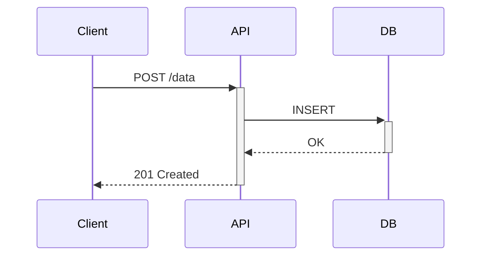
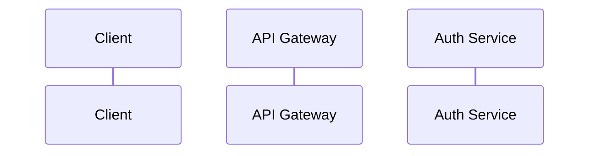
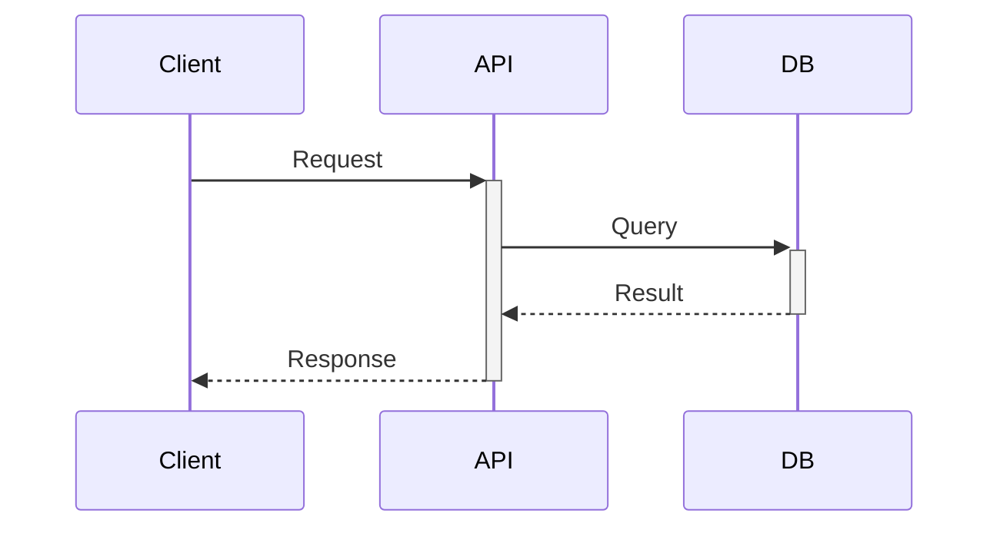
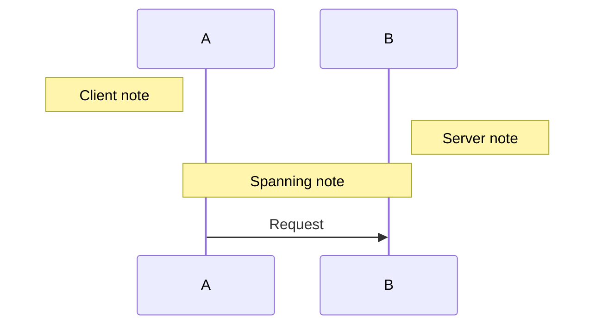
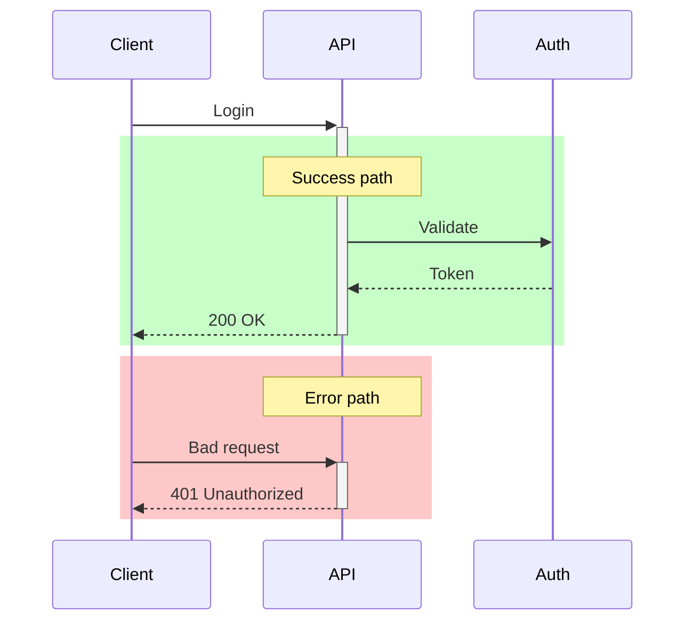
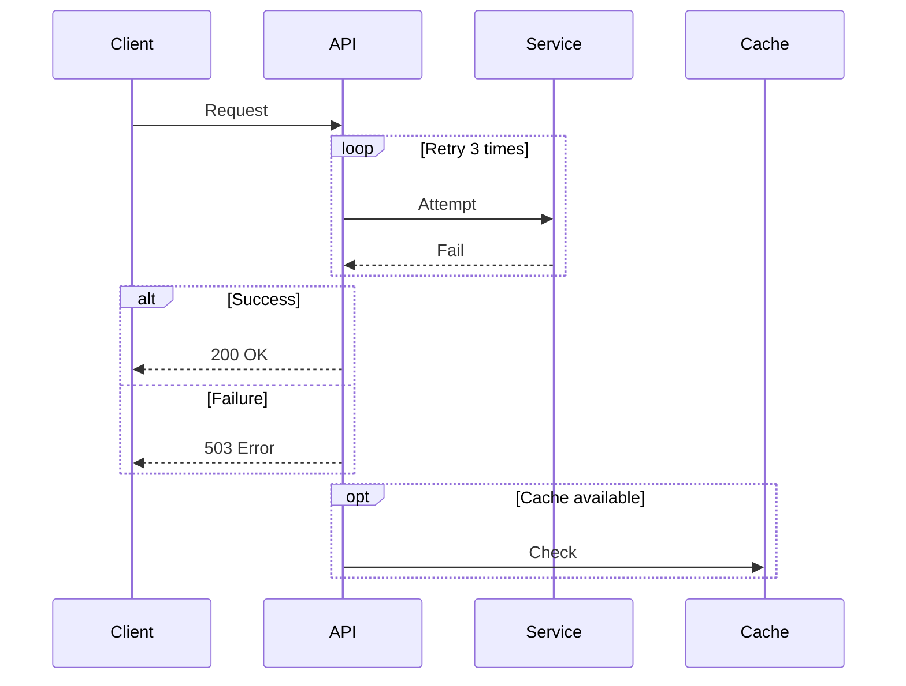

# Sequence Diagram Reference

**Use for**: Multi-party interactions, API calls, protocol flows, message exchanges, distributed system communication

**Don't use for**: Single function execution, linear workflows, static structure

---

## Basic Syntax

---

## Participant Declaration

- Participants appear left-to-right in declaration order
- Use `as` for short display names
- Keep to 6 participants max

---

## Arrow Types

| Syntax | Meaning |
|--------|---------|
| `->>` | Synchronous request |
| `-->>` | Synchronous response |
| `--)` | Async message (no response expected) |
| `--x` | Lost message |
| `->>+` | Request with activation start |
| `-->>-` | Response with activation end |

---

## Activation Boxes

Show when a participant is actively processing:

- `+` starts activation (box appears)
- `-` ends activation (box closes)
- Use to show which services are busy

---

## Notes

| Syntax | Position |
|--------|----------|
| `Note left of X` | Left side |
| `Note right of X` | Right side |
| `Note over X` | Above single |
| `Note over X,Y` | Spanning |

---

## Highlight Regions

Use `rect` to highlight scenarios:

*Regions: Green = success path, Red = error path*

---

## Loops and Conditionals

| Construct | Use for |
|-----------|---------|
| `loop` | Repeated actions |
| `alt/else` | Conditional branches |
| `opt` | Optional actions |
| `par` | Parallel actions |
| `critical` | Critical region |
| `break` | Early exit |

---

## Best Practices

- Use `rect` to highlight error/alternate scenarios
- Activation boxes show active processing
- Notes for context at key points
- Keep to 6 participants max
- Show both success and error paths
- Label arrows with HTTP methods or message types

---

## Common Mistakes

- Using for single-function call chain (use flowchart or list)
- Too many participants (>6 becomes unreadable)
- Missing return arrows
- No error scenarios shown
- Activation boxes never closed

---

## Value Proposition

Sequence diagrams show:
- **Temporal ordering** - what happens first
- **Service boundaries** - who talks to whom
- **Synchronous vs async** - blocking vs fire-and-forget
- **Error propagation** - where failures cascade

If you don't need to show time/order between parties, use a flowchart.

---

*Sequence diagrams show WHO talks to WHOM and WHEN.*
