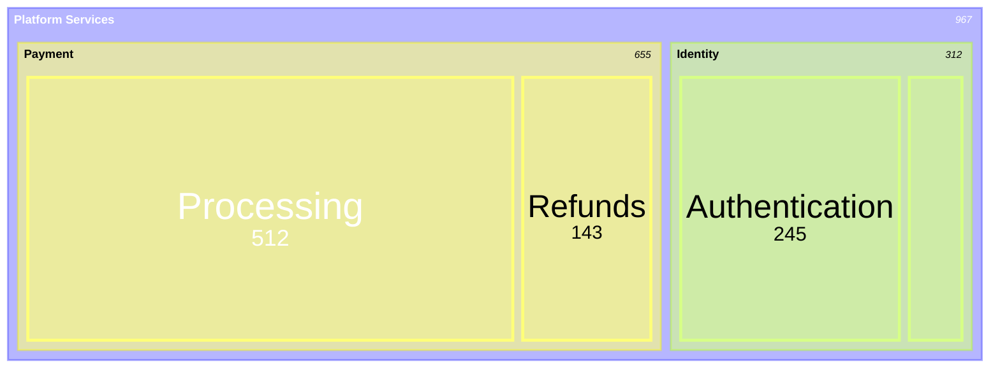

# Treemap Reference

**Use for**: Hierarchical proportional data, error distributions by service

**Don't use for**: Flat lists (use pie), trends (use XY)

---

## Basic Syntax


*Size: Area proportional to value*

---

## Rules

- **2-3 levels max** (deeper unreadable)
- **Positive values only** (no zero)
- Parent nodes: no values
- Leaf nodes: require values with colon syntax
- Max ~30 nodes total
- Minimum 2% of total for visibility

---

## Configuration

```yaml
---
config:
  treemap:
    showValues: false
    valueFormat: ","
---
```

---

## Best Practices

- Use for hierarchical data only
- Keep depth shallow (2-3 levels)
- Ensure leaf values are meaningful proportions
- Parent labels should describe the grouping

---

## Common Mistakes

- Too deep (>3 levels)
- Zero or negative values
- Values on parent nodes
- Tiny segments (<2% of total)

---

## Treemap vs Pie

| Aspect | Treemap | Pie |
|--------|---------|-----|
| Structure | Hierarchical | Flat |
| Depth | 2-3 levels | 1 level |
| Use when | Nested categories | Simple proportions |

---

**Note**: Experimental (v10.3.0+) - syntax may evolve.

---

*Treemaps show HIERARCHICAL PROPORTIONS. Use when data has parent-child structure.*
