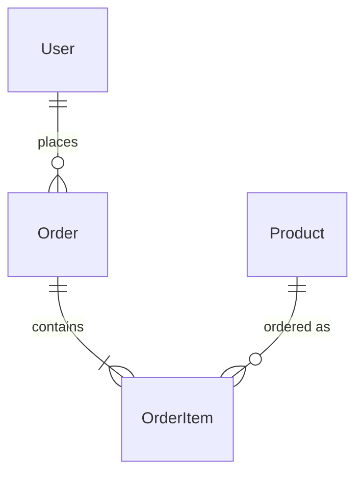
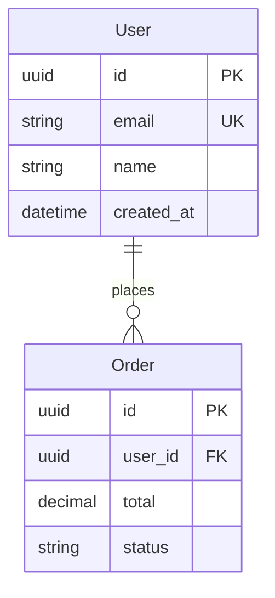
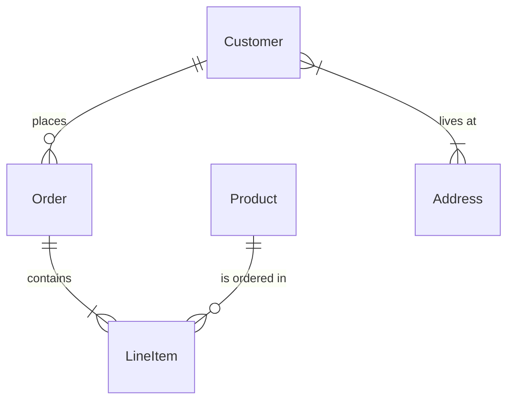
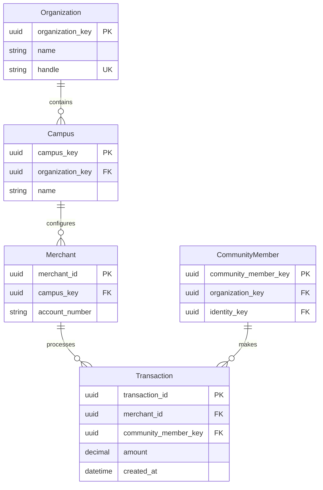

# Entity Relationship Diagram Reference

**Use for**: Database schema, data models, entity relationships, domain modeling

**Don't use for**: Code classes (use class diagram), API contracts, service interactions

---

## Basic Syntax

---

## Entity Attributes

---

## Cardinality Notation

| Symbol | Meaning |
|--------|---------|
| `\|\|` | Exactly one |
| `o\|` | Zero or one |
| `}o` | Zero or more |
| `}\|` | One or more |

**Reading direction**: Left side to right side

| Syntax | Meaning |
|--------|---------|
| `A \|\|--o{ B` | One A has zero or more B |
| `A \|\|--\|{ B` | One A has one or more B |
| `A }o--o{ B` | Many-to-many (needs junction table) |

---

## Relationship Labels

---

## Complete Example

---

## Supported Types

Common type names (no strict validation):
- `string`, `text`
- `int`, `integer`, `bigint`
- `uuid`, `guid`
- `decimal`, `float`
- `datetime`, `timestamp`, `date`
- `boolean`, `bool`
- `json`, `jsonb`

---

## Best Practices

- Show cardinality explicitly (one-to-many, many-to-many)
- Mark keys: PK (primary), FK (foreign), UK (unique)
- Use descriptive relationship labels (verbs)
- Include essential columns, not all columns
- Keep to 8-10 entities max per diagram
- Quote relationship labels with spaces

---

## Common Mistakes

- Missing foreign key relationships
- Unclear cardinality (which side is "many"?)
- Using for code objects (use class diagram)
- Too many entities (split by domain)
- Missing primary keys
- Unlabeled relationships

---

## ER vs Class Diagram

| Aspect | ER Diagram | Class Diagram |
|--------|------------|---------------|
| Focus | Data storage | Code structure |
| Shows | Tables, columns, FKs | Classes, methods, inheritance |
| Cardinality | Required | Optional |
| Methods | Never | Yes |
| Inheritance | Rarely | Common |

**Rule**: Modeling database tables? Use ER. Modeling code classes? Use class diagram.

---

*ER diagrams show HOW data is structured and related.*
