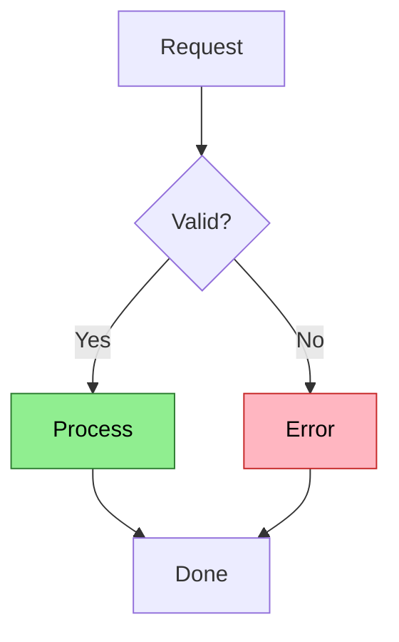
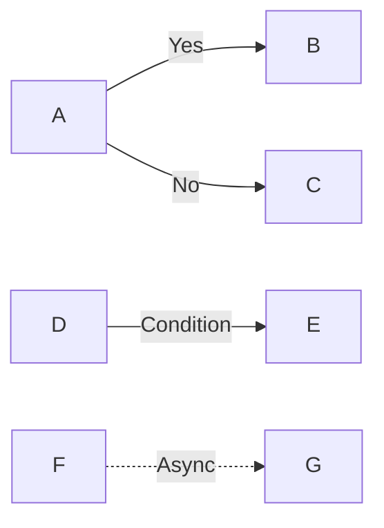
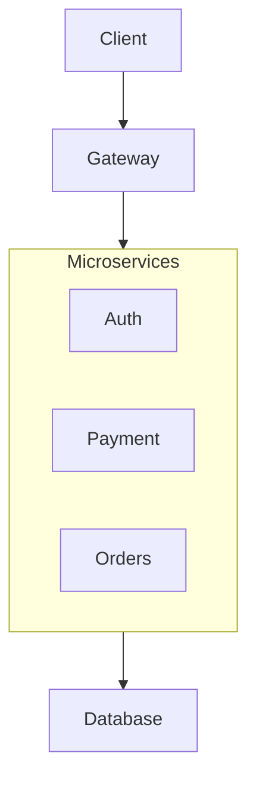
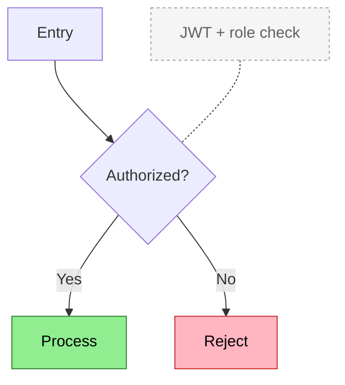

# Flowchart Reference

**Use for**: Processes with branches, decision trees, algorithms, validation logic

**Don't use for**: Linear sequences (list), multi-party interactions (sequence), state transitions (state diagram)

---

## Basic Syntax


*Colors: Green = success path, Red = error path*

---

## Direction Options

| Syntax | Direction |
|--------|-----------|
| `TD` or `TB` | Top to bottom (default) |
| `LR` | Left to right |
| `BT` | Bottom to top |
| `RL` | Right to left |

**Tip**: Use `LR` for cascading decisions, `TD` for process flows with shared sinks.

---

## Node Shapes

| Syntax | Shape | Use for |
|--------|-------|---------|
| `A[text]` | Rectangle | Standard steps |
| `A{text}` | Diamond | Decisions |
| `A([text])` | Stadium | Start/end |
| `A((text))` | Circle | Connectors |
| `A[[text]]` | Subroutine | Subprocess |
| `A[(text)]` | Cylinder | Database |
| `A>text]` | Asymmetric | Direction |

---

## Edge Labels



| Syntax | Style |
|--------|-------|
| `-->` | Solid arrow |
| `---` | Solid line |
| `-.->` | Dotted arrow |
| `-.-` | Dotted line (for notes) |
| `==>` | Thick arrow |
| `--text-->` | Labeled edge |
| `-->|text|` | Labeled edge (alt) |

---

## Group-Level Relationships

When many nodes share a relationship, connect to the subgraph:



---

## Notes for Context

Add detail without cluttering the flow:


*Colors: Green = success, Red = error, Gray dashed = contextual note*

**Warning**: Notes often cause edge crossings on diverging branches. Alternatives:
1. Put context in node labels with colors
2. Use edge labels instead
3. Move details to prose below diagram

---

## Best Practices

- Use diamonds `{}` for decisions (visually distinct)
- Color-code paths (success/error/info)
- Keep to 12 nodes max (split complex flows)
- Label edges with conditions `|Yes|` `|No|`
- Use subgraphs for logical grouping

---

## Common Mistakes

- Using for linear sequences (cardinal sin)
- Too many nodes (>15)
- Unclear decision conditions
- Missing error paths
- Unlabeled edges leaving decisions

---

## Layout Troubleshooting

If edges overlap:
1. Change declaration order (nodes laid out in declaration order)
2. Try different direction (`LR` vs `TD`)
3. Use ELK layout engine for complex routing:
   ```yaml
   ---
   config:
     layout: elk
   ---
   ```
4. Add intermediate layer between diverge and converge
5. Split into multiple diagrams

---

*Flowcharts show branching logic. No branches = use a list.*
