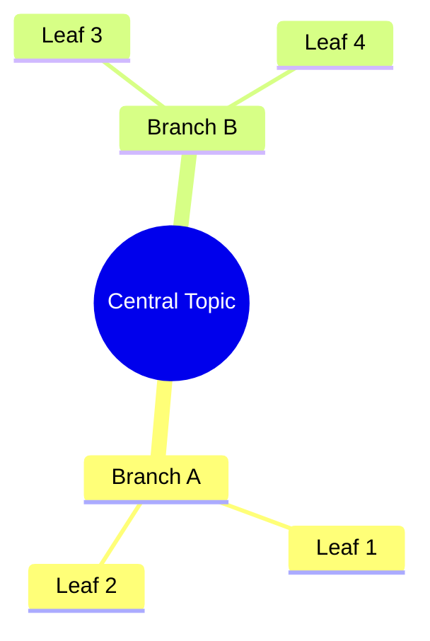
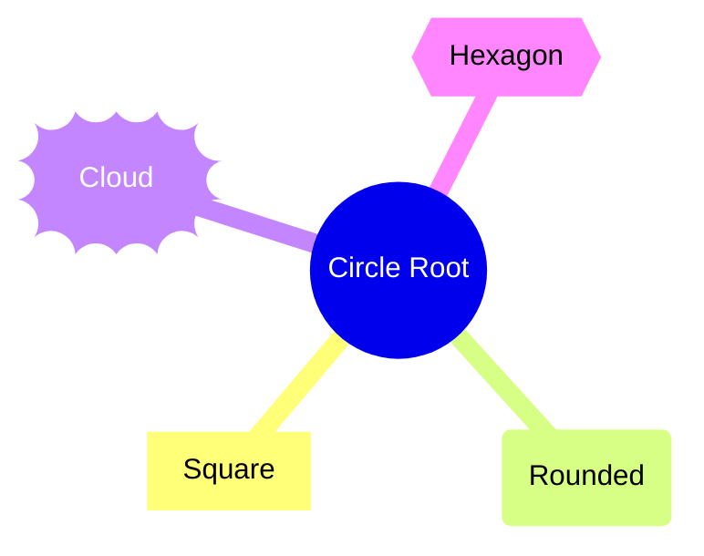
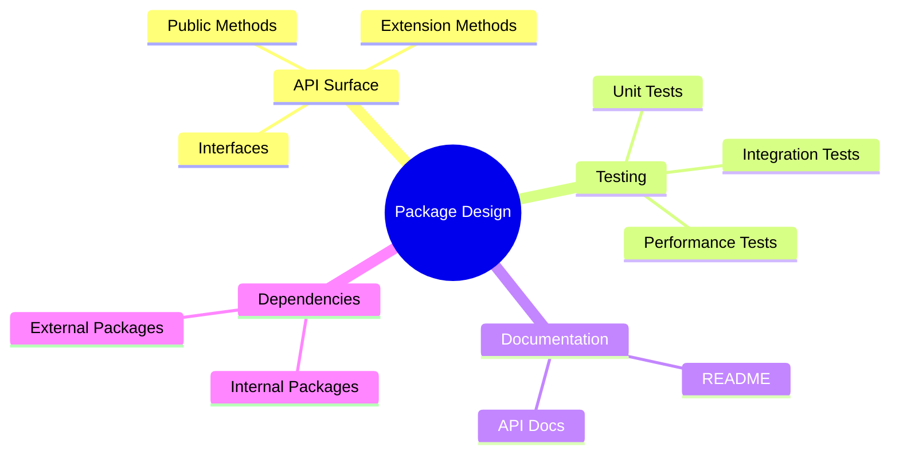
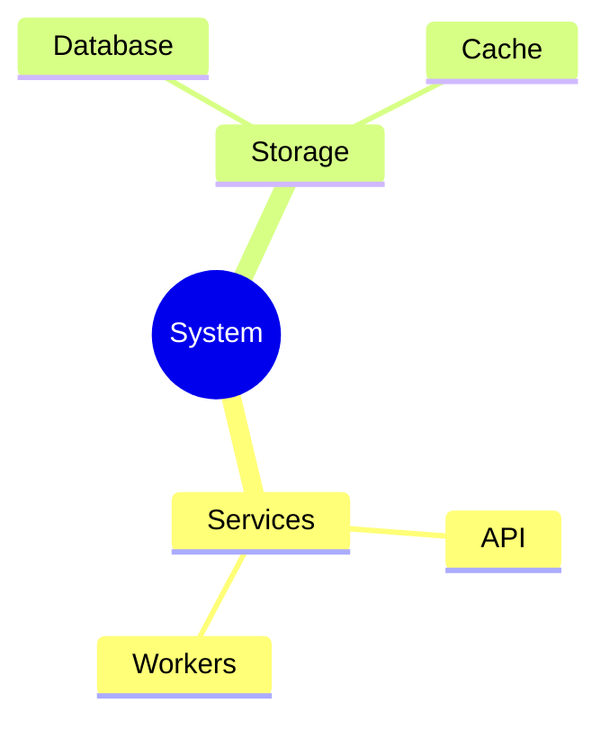

# Mindmap Reference

**Use for**: Concept hierarchies, brainstorming capture, topic breakdowns, knowledge organization

**Don't use for**: Workflows (use flowchart), code structure (use class diagram), time-based (use timeline)

---

## Basic Syntax

---

## Node Shapes

| Syntax | Shape |
|--------|-------|
| `((text))` | Circle |
| `[text]` | Square |
| `(text)` | Rounded |
| `))text((` | Cloud |
| `{{text}}` | Hexagon |

---

## Hierarchy Structure

---

## Icons

Uses Font Awesome icons: `::icon(fa fa-iconname)`

---

## Best Practices

- Keep to 3-4 levels deep (root -> branch -> sub -> leaf)
- Balance branches (similar depth and breadth)
- Root node in `((double parentheses))`
- Use for brainstorming capture
- One concept per node
- Clear, concise labels

---

## Common Mistakes

- Using for sequential workflows (use flowchart)
- Unbalanced depth (one branch with 5 levels, another with 2)
- Too many levels (>5 becomes unreadable)
- Too many nodes per branch
- Unclear hierarchy
- Using for processes with order

---

## Mindmap vs Other Types

| Need | Use |
|------|-----|
| Concept breakdown | Mindmap |
| Process with decisions | Flowchart |
| Class structure | Class diagram |
| Data relationships | ER diagram |
| Service topology | Architecture |

---

*Mindmaps show HOW concepts relate hierarchically.*
