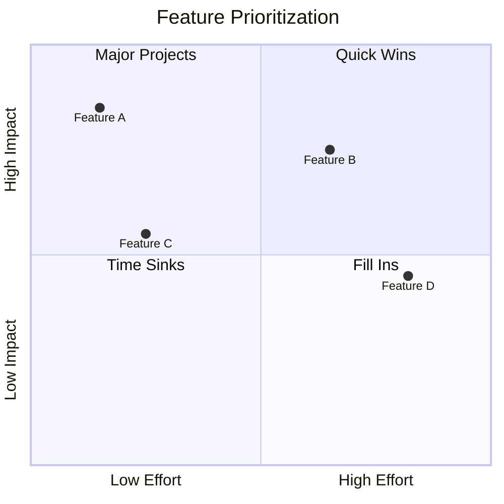

# Quadrant Chart Reference

**Use for**: Prioritization (2 dimensions), risk assessment, effort/impact matrices

**Don't use for**: >2 dimensions, precise data

---

## Basic Syntax

*Quadrants: Q1 (top-left) = do first*

---

## Rules

- **Values: 0.01 < x,y < 0.99** (extremes unreadable)
- Short labels (12 chars max)
- No duplicate coordinates
- Max 10-12 items
- Label quadrants meaningfully
- Upper-left = highest priority (low effort, high impact)

---

## Quadrant Numbering

| Quadrant | Position | Typical meaning |
|----------|----------|-----------------|
| quadrant-1 | Top-left | Quick wins |
| quadrant-2 | Top-right | Major projects |
| quadrant-3 | Bottom-left | Time sinks |
| quadrant-4 | Bottom-right | Fill-ins |

---

## Best Practices

- Always label both axes with direction (Low --> High)
- Name quadrants for your context
- Keep items away from edges
- Use for relative positioning, not precise values

---

## Common Mistakes

- Values at 0 or 1 (invisible/edge)
- Too many items (>12)
- Unlabeled quadrants
- Missing axis direction labels

---

*Quadrant charts show 2D PRIORITIZATION. Use for effort/impact, risk/reward, urgency/importance.*
