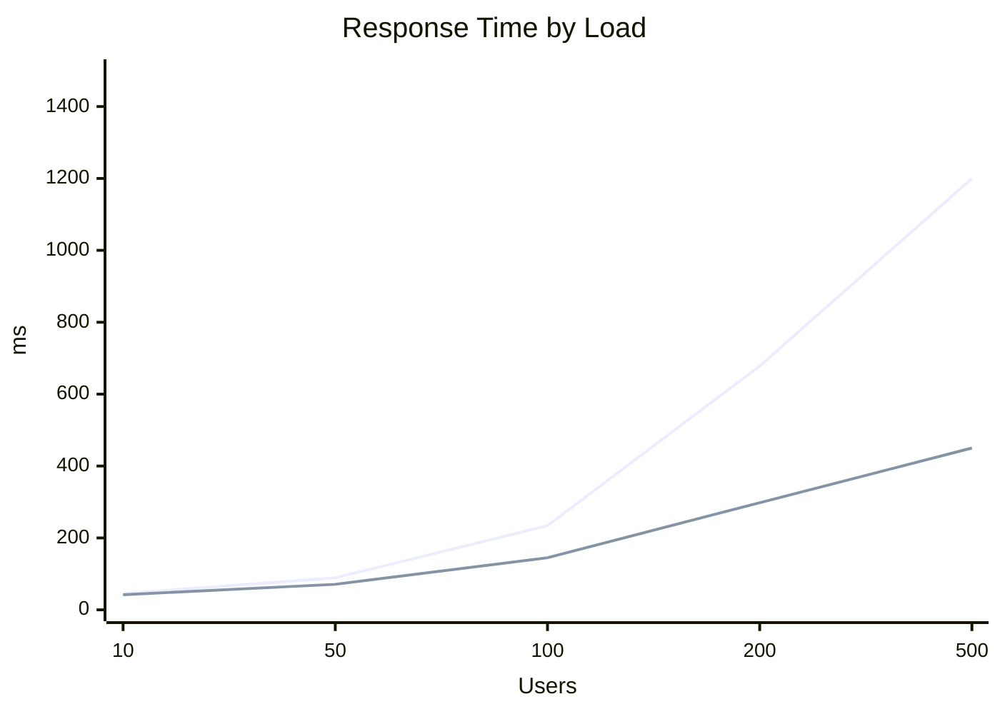
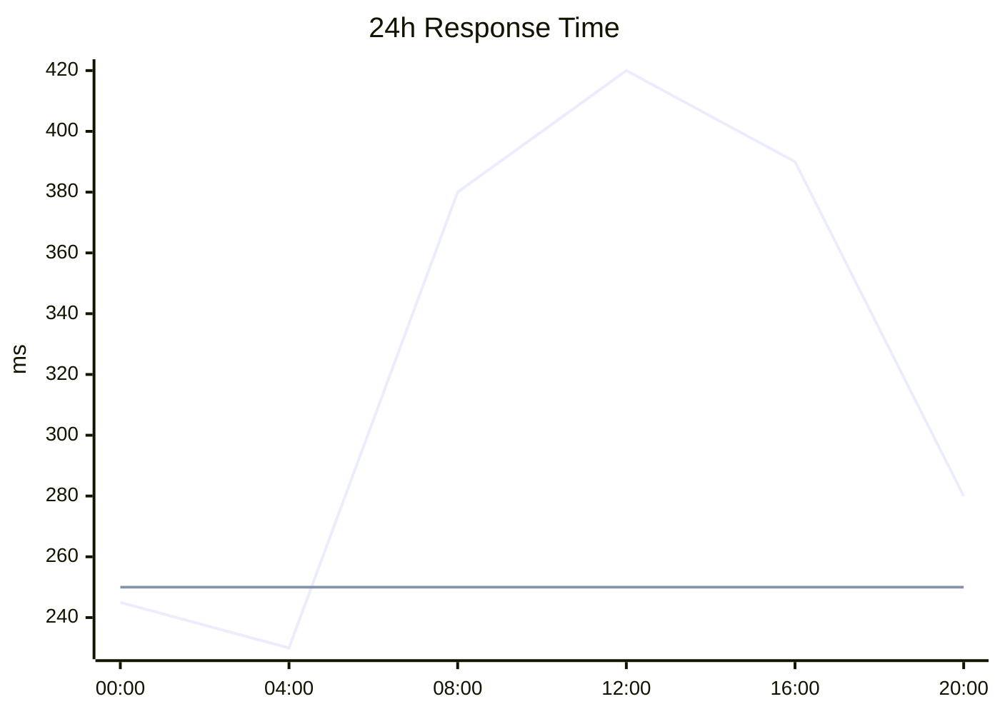

# XY Chart Reference

**Use for**: Time-series metrics, performance trends, multi-series comparisons

**Don't use for**: Conceptual data, scatter plots (not supported)

---

## Basic Syntax


*Trend: Async scales better at high concurrency*

---

## Time-Series Example



---

## Rules

- Label axes with units
- **Quote time labels**: `["00:00"]` not `[00:00]`
- Max 4 lines per chart
- Sample 6-8 points for readability
- Use flat line for baseline comparison

---

## Configuration

```yaml
---
config:
  xyChart:
    showValues: false
    valueFormat: ","
---
```

---

## Best Practices

- Always label both axes
- Include units in axis labels
- Use consistent intervals on x-axis
- Add baseline for comparison when useful

---

## Common Mistakes

- Unquoted time labels
- Too many data points (>10)
- Missing axis labels
- Too many lines (>4)

---

**Note**: Experimental (v10.0.0+) - syntax may evolve.

---

*XY charts show TRENDS over a dimension. Use for time-series and comparisons.*
